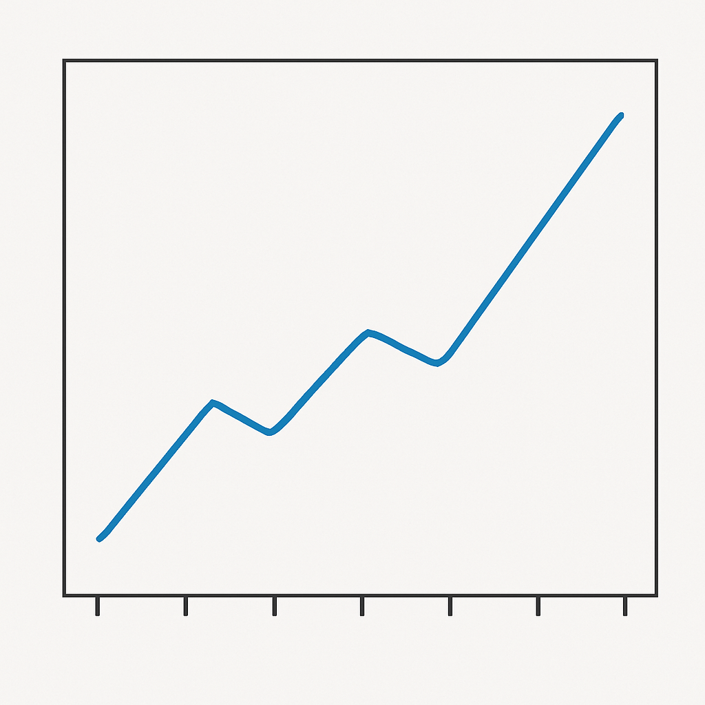

# Introduction

Write your introduction here [@asgariContinuousDistributedRepresentation2015].

# Materials and methods

The following equation [-@eq:fundamental] represents...

$$
\int_{a}^{b} f(x) \, dx = F(b) - F(a)
$$ {#eq:fundamental}

The pseudocode for the Bubble Sort algorithm is shown in Listing [-@lst:bubblesort]:

```plaintext {#lst:bubblesort caption="Pseudo code of bubble sort"}
procedure BubbleSort(A: list of items)
    n := length(A)
    for i from 1 to n - 1 do
        for j from 0 to n - i - 1 do
            if A[j] > A[j + 1] then
                swap(A[j], A[j + 1])
            end if
        end for
    end for
end procedure
```
The following Listing [-@lst:javahelloworld] shows a small Java program.

```java {#lst:javahelloworld caption="A Java Hello World program"}
class HelloWorld {
    public static void main(String[] args) {
        System.out.println("hello!");
    }
}
```

\newpage
# Results

As shown in Table 1 (Summary of experimental results), the experimental results demonstrate significant improvements across all metrics.

Tables [-@tbl:results] and [-@tbl:results2] summarize the outcomes.


| Experiment | Metric A | Metric B | Metric C |
|------------|----------|----------|----------|
| Exp 1      | 0.85     | 0.78     | 0.92     |
| Exp 2      | 0.88     | 0.81     | 0.95     |
| Exp 3      | 0.90     | 0.85     | 0.97     |
Table: Results of the treatment experiment {#tbl:results}


| Experiment | Metric W | Metric X | Metric Y | Metric Z |
|------------|----------|----------|----------|----------|
| Exp A      | 0.60     | 0.65     | 0.70     | 0.75     |
| Exp B      | 0.68     | 0.72     | 0.78     | 0.80     |
| Exp C      | 0.75     | 0.78     | 0.82     | 0.85     |
Table: Results of the treatment experiment {#tbl:results2}

As Figure [-@fig:setup] shows...

{#fig:setup}


# Conclusion

Write your conclusion here.

# References
<!-- pandoc will place the references at the end of the paper -->
